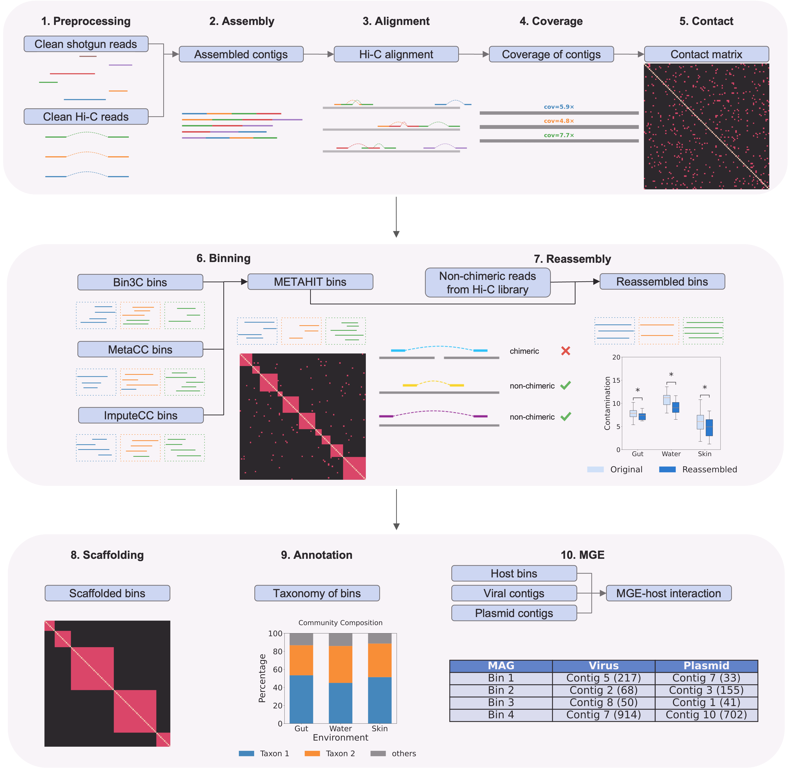

# METAHIT
METAHIT enables comprehensive and flexible genome-resolved microbiome analysis with metagenomic Hi-C

## Installation
### Dependencies
To install all dependencies required for **METAHIT**, run the setup script located in the `0_installation` folder:
```bash
bash run_setup_in_venv.sh
```
This command will automatically create and activate a minimal Conda environment (`metahit_venv`) and then execute `setup.sh` inside it. During this process, all necessary tools and environments (e.g., BBTools, CheckM2, GTDB-Tk, geNomad, CheckV) will be downloaded, configured, and installed into an `external/` directory within the repository. Once setup completes, you can optionally add `external/bin/` to your system `PATH` for easier access to the installed executables.

### Databases
The folder `0_installation/db_setup` contains four scripts to download and set up databases for **CheckM**, **CheckM2**, **CheckV**, and **GTDB-Tk**.  
By default, each script downloads the database into a `database/` folder in your current working directory, but you can optionally provide a custom path.
**CheckM database downloading:**  
```bash
bash 0_installation/db_setup/checkm_db.sh [DB_DIR]
```
**CheckM2 database downloading:**  
```bash
bash 0_installation/db_setup/checkm2_db.sh [DB_DIR]
```
**CheckV database downloading:**  
```bash
bash 0_installation/db_setup/checkv_db.sh [DB_DIR]
```
**GTDB-Tk database downloading:**  
```bash
bash 0_installation/db_setup/gtdbtk_db.sh [DB_DIR]
```

## Usage
Once installation and database setup are complete, **METAHIT** can be run by executing each module independently. The framework consists of **10 main modules**, each corresponding to a numbered folder in the repository:
1. `preprocessing`
2. `assembly`
3. `alignment` 
4. `coverage`
5. `contact`
6. `binning` 
7. `reassembly` 
8. `scaffolding` 
9. `annotation`
10. `MGE` 
You can view the overall structure of METAHIT below:


### Basic Usage
Each module can be executed separately.  
For example, to run the **binning** module:


### Selective Execution
Some modules are **optional** and can be skipped.  
For instance, you may choose to stop at binning (`6_binning`) or reassembly (`7_reassembly`) depending on your analysis goals.  
Each module automatically reads the standardized outputs of the preceding stage, allowing flexible, modular execution.


