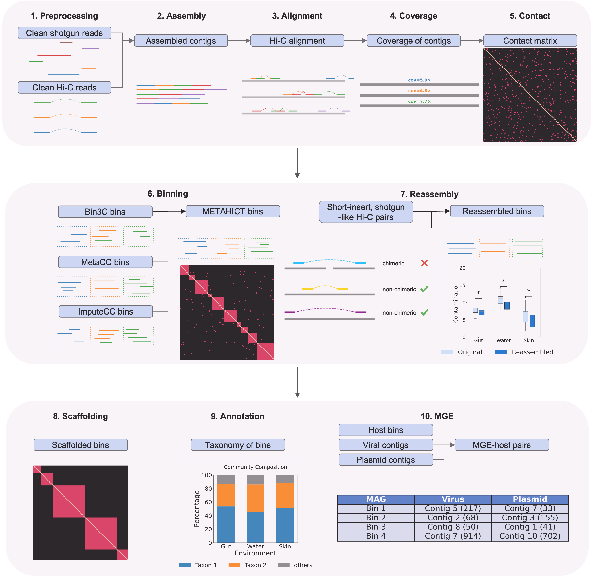

# METAHICT

**METAHICT** enables comprehensive genome-resolved microbiome analysis with metagenomic Hi-C.

METAHICT v1.1.0 is distributed as a Nextflow DSL2 workflow with module-level command-line wrappers. The workflow supports raw-read processing, assembly, Hi-C alignment, coverage estimation, contact generation and normalization, Hi-C-informed binning and consolidation, per-bin reassembly, Hi-C-guided scaffolding, GTDB-Tk annotation, and MGE-MAG candidate proximity-association analysis.



## Quick start

Clone the repository:

```bash
git clone https://github.com/dyxstat/METAHICT.git
cd METAHICT
```

Install the local software environments:

```bash
bash installation/run_setup_in_venv.sh
```

Download the reference databases into the default project layout:

```bash
bash installation/db/checkm_db.sh databases/checkm_db
bash installation/db/checkm2_db.sh databases/checkm2_db
bash installation/db/gtdbtk_db.sh databases/gtdbtk_db/release220
bash installation/db/genomad_db.sh databases/genomad_db
```

Run the bundled smoke test:

```bash
bash nextflow/ci/run_smoke_ci.sh
```

Download the example FASTQ files from Zenodo before running the example sample sheet:

```text
https://doi.org/10.5281/zenodo.21695166
```

```bash
bash nextflow/run_metahict_nextflow.sh run nextflow/main_dsl2.nf \
  -profile local \
  --samplesheet nextflow/assets/example_data_samplesheet.csv \
  --out_root "$PWD/results/example_data" \
  --report_dir "$PWD/results/example_data/nextflow_reports" \
  -work-dir "$PWD/results/example_data/nextflow_work" \
  -ansi-log false
```

## Documentation

The detailed documentation is split into focused pages:

- [Installation and databases](docs/installation.md)
- [Example dataset](docs/example_dataset.md)
- [Nextflow workflow usage](docs/nextflow.md)
- [Module documentation](docs/modules/README.md)

Module-specific pages describe inputs, outputs, parameters, and selected-module execution:

- [Module 1: preprocessing](docs/modules/module1_preprocessing.md)
- [Module 2: assembly](docs/modules/module2_assembly.md)
- [Module 3: alignment](docs/modules/module3_alignment.md)
- [Module 4: coverage](docs/modules/module4_coverage.md)
- [Module 5: contact generation and normalization](docs/modules/module5_contact.md)
- [Module 6: binning and consolidation](docs/modules/module6_binning.md)
- [Module 7: reassembly](docs/modules/module7_reassembly.md)
- [Module 8: scaffolding](docs/modules/module8_scaffolding.md)
- [Module 9: annotation](docs/modules/module9_annotation.md)
- [Module 10: MGE analysis](docs/modules/module10_mge.md)

## Key outputs

Important workflow outputs include:

- consolidated MAGs: `6_binning/binning/metahict/metahict_50_10_bins/`
- reassembled bins: `7_reassembly/reassembly/reassembled_bins/`
- reassembled-bin name map: `7_reassembly/reassembly/reassembled_bin_name_map.tsv`
- combined contigs for downstream analysis: `7_reassembly/reassembly/combined_contigs.fa`
- MGE-MAG candidate associations: `10_MGE/mge/candidate_mge_mag_associations_zscore_filtered.tsv`
- sequence topology annotations: `10_MGE/mge/sequence_topology.tsv`
- GTDB-Tk annotations: `9_annotation/annotation/gtdbtk.*.summary.tsv`

## Third-party software

Integrated software, versions, licenses, and citations are summarized in [THIRD_PARTY.md](THIRD_PARTY.md).

The METAHICT-compatible bin3C, ImputeCC, and MetaCC code used by METAHICT is
maintained separately:

```text
https://github.com/dyxstat/bin3C/tree/bin3C-Python3
https://github.com/dyxstat/ImputeCC/tree/ImputeCC-METAHICT
https://github.com/dyxstat/MetaCC/tree/MetaCC-METAHICT
```

## License

METAHICT is distributed under the GNU General Public License. See [LICENSE](LICENSE).
